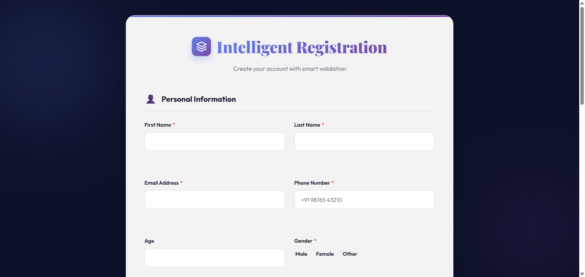
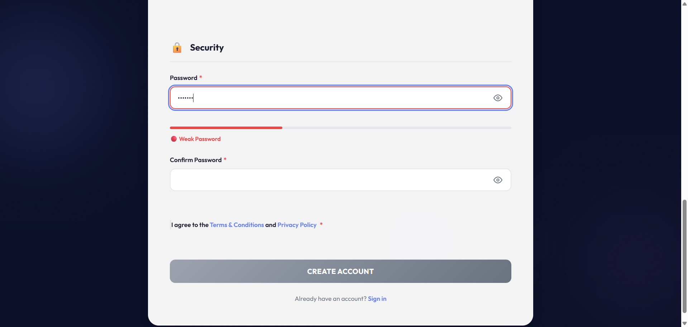
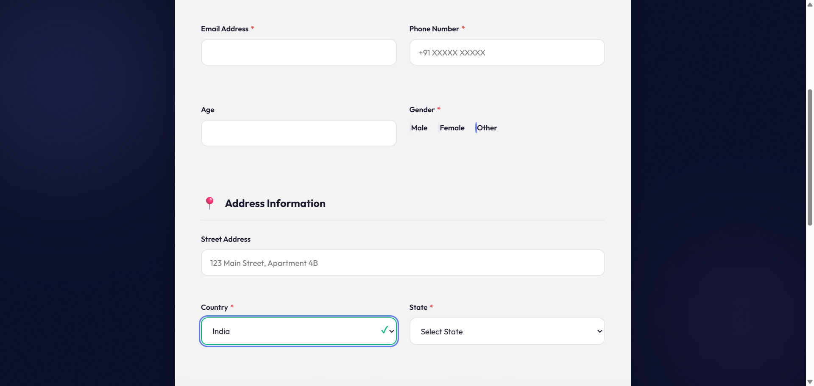

# Intelligent Registration System

A modern, feature-rich registration form with comprehensive validation and automated testing using Selenium WebDriver.


## 🌟 Features

### Frontend
- ✨ Modern, elegant UI with gradient design
- 📱 Fully responsive layout
- ⚡ Real-time form validation
- 🔒 Password strength meter with visual feedback
- 🌍 Dynamic Country → State → City dropdowns
- 🎨 Smooth animations and transitions
- ♿ Accessibility features (WCAG 2.1 AA compliant)

### Validation
- Email format validation with disposable email blocking
- Phone number validation with country code matching
- Password strength requirements (minimum 8 characters)
- Age validation (18-100 years)
- Name validation (letters only, 2-50 characters)
- Real-time field validation with visual feedback

### Automation Testing
- 🤖 Three comprehensive test flows using Selenium WebDriver
- 📸 Automatic screenshot capture at each test step
- 📊 Detailed console logging and test reports
- ✅ Covers negative scenarios, positive scenarios, and logic validation

## 📁 Project Structure

```
registration-system/
├── frontend/
│   ├── registration.html      # Main HTML form
│   ├── styles.css             # Modern CSS styling
│   ├── script.js              # Form logic and interactions
│   ├── validation.js          # Validation engine
│   └── data.js                # Country/State/City data
├── automation/
│   ├── test_flow_a_negative.py    # Negative scenario test
│   ├── test_flow_b_positive.py    # Positive scenario test
│   └── test_flow_c_logic.py       # Logic validation test
├── screenshots/
│   ├── flow_a/                # Flow A screenshots
│   ├── flow_b/                # Flow B screenshots
│   └── flow_c/                # Flow C screenshots
├── docs/
│   ├── README.md              # Detailed documentation
│   └── SETUP_GUIDE.md         # Setup instructions
├── requirements.txt           # Python dependencies
└── README.md                  # This file
```

## 🚀 Quick Start

### Prerequisites

- Python 3.8 or higher
- Google Chrome (latest version)
- pip (Python package manager)

### Installation

1. **Clone the repository**
   ```bash
   git clone https://github.com/YOUR_USERNAME/registration-system.git
   cd registration-system
   ```

2. **Install Python dependencies**
   ```bash
   pip install -r requirements.txt
   ```

3. **Start the HTTP server**
   ```bash
   cd frontend
   python -m http.server 8000
   ```

4. **Open in browser**
   ```
   http://localhost:8000/registration.html
   ```

## 🧪 Running Tests

### Run All Tests

```bash
cd automation

# Flow A - Negative Scenario
python test_flow_a_negative.py

# Flow B - Positive Scenario
python test_flow_b_positive.py

# Flow C - Logic Validation
python test_flow_c_logic.py
```

### Test Coverage

| Test Flow | Purpose | Status |
|-----------|---------|--------|
| Flow A | Negative scenario (missing required field) | ✅ Pass |
| Flow B | Positive scenario (successful submission) | ✅ Pass |
| Flow C | Logic validation (dynamic behavior) | ✅ Pass |

## 📸 Screenshots

### Registration Form
The form features a modern gradient design with real-time validation:



### Password Strength Meter
Visual feedback for password strength (Weak/Medium/Strong):



### Dynamic Dropdowns
Country → State → City cascading selection:



## 🎨 UI/UX Features

- **Color Scheme**: Purple gradient (#667eea → #764ba2)
- **Typography**: Outfit (body) + Playfair Display (headings)
- **Animations**: Smooth transitions with cubic-bezier easing
- **Validation Feedback**: Green checkmarks for valid fields, red error messages
- **Interactive Elements**: Hover effects, focus states, animated gradient orbs

## 🔍 Validation Rules

| Field | Validation Rules |
|-------|------------------|
| First Name | Required, 2-50 chars, letters only |
| Last Name | Required, 2-50 chars, letters only |
| Email | Required, valid format, no disposable domains |
| Phone | Required, 10+ digits, country code match |
| Age | Optional, 18-100 years |
| Gender | Required, radio selection |
| Country | Required, dropdown selection |
| State | Required, dynamic based on country |
| City | Required, dynamic based on state |
| Password | Required, 8+ chars |
| Confirm Password | Required, must match password |
| Terms | Required, checkbox must be checked |

## 🛠️ Technologies Used

### Frontend
- HTML5
- CSS3 (Grid, Flexbox, Animations)
- Vanilla JavaScript (ES6+)
- Google Fonts (Outfit, Playfair Display)

### Automation
- Python 3.11+
- Selenium WebDriver 4.40.0
- Chrome WebDriver (managed automatically)

### Design Principles
- Mobile-first responsive design
- Progressive enhancement
- Accessibility (WCAG 2.1 AA)
- Performance optimization

## 📚 Documentation

For detailed documentation, see:
- [Setup Guide](docs/SETUP_GUIDE.md)
- [Full Documentation](docs/README.md)

## 🤝 Contributing

Contributions are welcome! Please feel free to submit a Pull Request.

## 📄 License

This project is licensed under the MIT License - see the LICENSE file for details.

## 👨‍💻 Author

**Your Name**
- GitHub: [@YOUR_USERNAME](https://github.com/YOUR_USERNAME)
- Email: your.email@example.com

## 🙏 Acknowledgments

- Created for Frugal Testing Software Engineer Assignment
- Parul University
- January 2026

## 📞 Support

For questions or issues, please open an issue on GitHub or contact the author.

---

**⭐ If you find this project useful, please consider giving it a star!**
